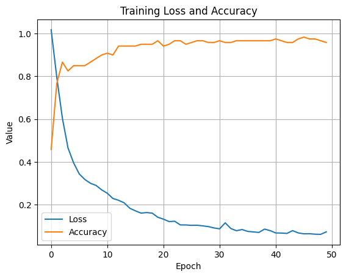

# 🧠 Real Data Regression with PyTorch Autograd

# 🌸 Iris Flower Classifier with PyTorch

This project implements a simple neural network using PyTorch to classify **Iris flowers** into one of three species:

- **Setosa**
- **Versicolor**
- **Virginica**

The model is trained using 4 input features:
- Sepal Length
- Sepal Width
- Petal Length
- Petal Width

## 🔧 Technologies Used
- Python
- PyTorch
- scikit-learn
- Matplotlib
- Google Colab

## 📁 Files
| File Name               | Description                                      |
|-------------------------|--------------------------------------------------|
| `iris_classifier.ipynb` | Full training notebook (model, plots, results)   |
| `loss_accuracy_plot.png`| Training loss & accuracy plot                   |

## 📊 Model Details
- **Input Layer**: 4 features
- **Hidden Layer**: 8 neurons + ReLU
- **Output Layer**: 3 neurons (class scores)
- **Loss Function**: CrossEntropyLoss
- **Optimizer**: Adam

## 📈 Results
- Final Test Accuracy: ~95% (may vary slightly per run)
- Training converges within 50 epochs

## 🖼️ Output Plot


## 🚀 How to Use

Run the code in [Google Colab](https://colab.research.google.com/drive/1knpgx_yYqtCV9GSUqqPeflOwBfss0Pm4?usp=sharing)


```bash
# In your notebook
python iris_classifier.ipynb
